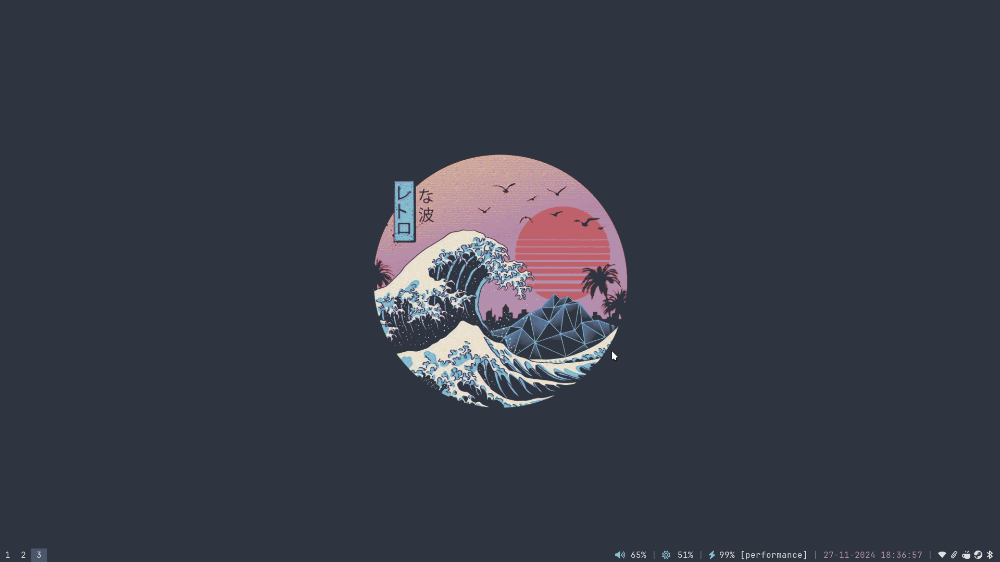

### i3

### Xfce

### Setup
- Desktop Environment(s) - i3 (primary), xfce (secondary)
- Editor - Vim (SpaceVim), Visual Studio Code
- Colorscheme - Nord
- OS - Debian (Sid)
- Shell - Fish
- Terminal - Alacritty
